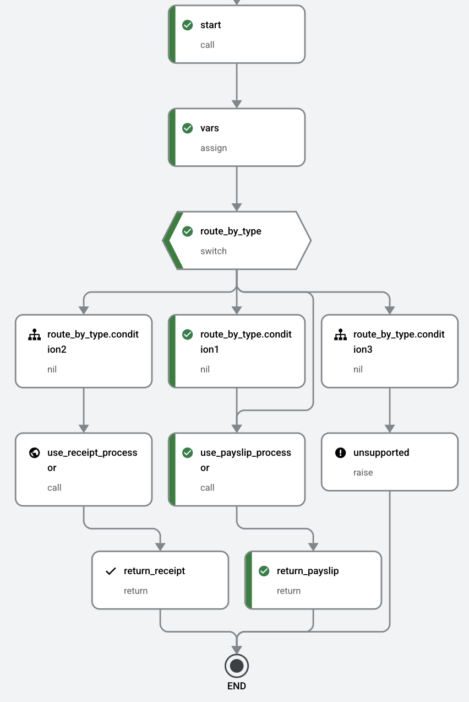

# Project Structure

```
case_study/
├── src/
│   ├── extract/             # Workflow client to extract structured JSON
│   ├── configs/             # YAML and configuration files
│   ├── similarity_search/   # Similarity search backend modules
│   ├── tip_generation/      # Tax tip generation modules
│   ├── scripts/             # Utility scripts (prettify, etc.)
│   ├── notebooks/           # Pattern Recognition Analysis 
│   └── run_docai.py         # Workflow entry point
├── figures/                 # Diagrams and visual assets
├── demo.ipynb               # Demo notebook showcasing similarity search and tip generation
├── pyproject.toml           # Dependency definitions
├── uv.lock                  # Locked dependency file for uv
├── docker-compose.yml       # Docker Compose definitions (e.g., Qdrant)
└── README.md                # Project documentation
```

# Document AI Workflow 

This project runs Google Cloud Document AI Workflows to process **payslip** and **receipt** documents (PDFs or images) using separate processors and structured outputs.

---

## Similarity Search Approach

Transactions exist in two modalities—images (receipts) and tabular data (bank statements)—so to compare them directly, each transaction must first be aligned in a common embedding space. To achieve this, every record is converted into a dense vector using a pretrained model (e.g., OpenAI’s CLIP applied to rich text descriptions of the transaction). These vectors are then indexed in Qdrant for efficient nearest-neighbor lookup. At query time, a given transaction’s embedding is compared against the index to retrieve the top-K most similar transactions, enabling fast, scalable cross-modal search of related spending patterns.

## Tax Tip Generation Approaches

Two complementary methods are provided for personalized tip generation:

1. **Cluster-Based Recommendations:** Users are grouped into behavioral cohorts via clustering (e.g., KMeans on spend ratios and demographics). Spending categories where an individual’s ratio falls below the cohort average (“expense gaps”) are then identified, and tips are generated to review and potentially claim those categories for higher refunds.

2. **Recommender System (EASE):** An Embarrassingly Shallow Autoencoder (EASE) learns category co‑occurrence patterns to predict missing categories. To prioritize high‑impact suggestions, a penalty based on each category’s historical refund impact is applied, ensuring recommendations both address consumption gaps and maximize expected refund uplift.

---

## Pattern Recognition Analysis
Available in [patterns notebook](src/notebooks/patterns.ipynb).

## Demo: Similarity Search & Tax Tip Generation
Available in [demo notebook](demo.ipynb).

## Extracted Structured JSON
Available in the `outputs/` folder.

##  Prerequisites and Installation

### Google Cloud Setup

1. **Enable Required APIs**:
   - [Document AI](https://console.cloud.google.com/flows/enableapi?apiid=documentai.googleapis.com)
   - [Workflows](https://console.cloud.google.com/flows/enableapi?apiid=workflows.googleapis.com)
   - [Cloud Storage](https://console.cloud.google.com/flows/enableapi?apiid=storage.googleapis.com)

2. **Create & Structure GCS Bucket**:
   ```
   Bucket: extract_documents
   ├── payslip/input/
   └── receipt/input/
   ```

3. **Create Document AI Processors**:
   - `payslip` (Pay Slip Parser) for payslips
   - `receipt` (Expense Parser) for image receipts

4. **Create a Cloud Workflow**:
   - Name: `docai-workflows`
   - Region: `europe-west3` or `eu`
   - Upload the provided workflow file (see below)

5. **Grant IAM Roles**:
   - `roles/workflows.invoker`
   - `roles/documentai.apiUser`
   - `roles/storage.admin`

---

### Workflow Deployment

The workflow definition is located at:

```
src/configs/worflow_config.yaml
```

To deploy it to Google Cloud:

```bash
gcloud workflows deploy docai-workflows \
  --location=europe-west3 \
  --source=src/configs/worflow_config.yaml
```


---

##  Local Setup with [`uv`](https://github.com/astral-sh/uv)

### 1. Install `uv` if needed:

```bash
curl -LsSf https://astral.sh/uv/install.sh | sh
```

### 2. Clone the repo

```bash
git clone https://github.com/your-org/case_study.git
cd case_study
```

### 3. Set up the virtual environment and install dependencies

```bash
python3 -m venv .venv
source .venv/bin/activate
uv pip install -r pyproject.toml
```

### Qdrant via Docker Compose

To run Qdrant locally using Docker Compose, create a `docker-compose.yml` at the project root with:

```yaml
version: '3.8'
services:
  qdrant:
    image: qdrant/qdrant:latest
    ports:
      - '6333:6333'
    volumes:
      - ./qdrant_storage:/qdrant/storage
    restart: unless-stopped
```

Then start the service with:

```bash
docker-compose up -d
```


##  Environment Variables (`.env`)

Create a file called `.env` at the root of the project with the following contents:

```env
# Google Cloud project
PROJECT_ID=your-gcp-project-id

# Workflow configuration
WORKFLOW_NAME=name
WORKFLOW_REGION=your-region
PROCESSOR_LOCATION=your-region

# Buckets for input/output
INPUT_BUCKET=extract_documents
OUTPUT_BUCKET=extract_documents

# Processor IDs (from Document AI Console)
PAYSLIP_PROCESSOR_ID=your-payslip-processor-id
RECEIPT_PROCESSOR_ID=your-receipt-processor-id
```

---

## Running the Workflow

run `run_docai.py`:

```bash
uv run run_docai.py
```

This will:
- Upload documents to GCS
- Trigger the appropriate processor via workflow
- Wait for completion
- Download the parsed results to a local folder

###  Prettify Raw JSON Output

After extracting the raw JSON files from Document AI, run the prettifier:

```bash
uv run src/scripts/prettify_documents.py -i data/raw_json -o data/receipts_output
```

Replace `-i` and `-o` paths as needed depending on the document type.

---

##  Workflow Diagram

The following diagram illustrates how the workflow routes and processes documents:



###  Logic Summary

1. **start**: Logs incoming payload.
2. **vars**: Extracts input parameters and sets environment variables.
3. **route_by_type**: Branches logic based on `docType` (`payslip` or `receipt`).
4. **use_receipt_processor** / **use_payslip_processor**: 
   - Submits a batch processing request to the correct Document AI processor.
   - Receives a long-running operation handle.
5. **wait_for_receipt** / **wait_for_payslip**:
   - Polls the operation until completion (`done: true`).
6. **return**: Returns final result metadata to the client.

If an unsupported `docType` is provided, the `unsupported` step will raise an error.

---


